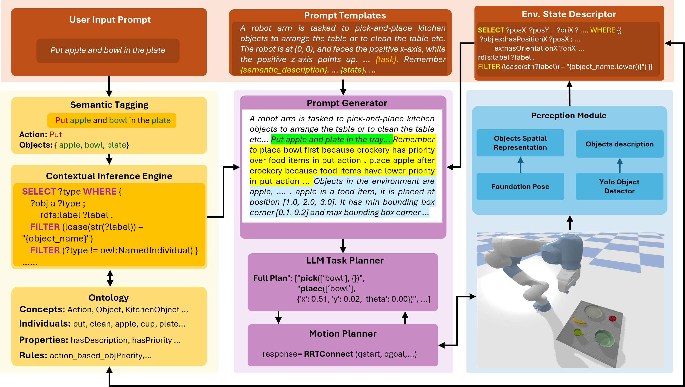
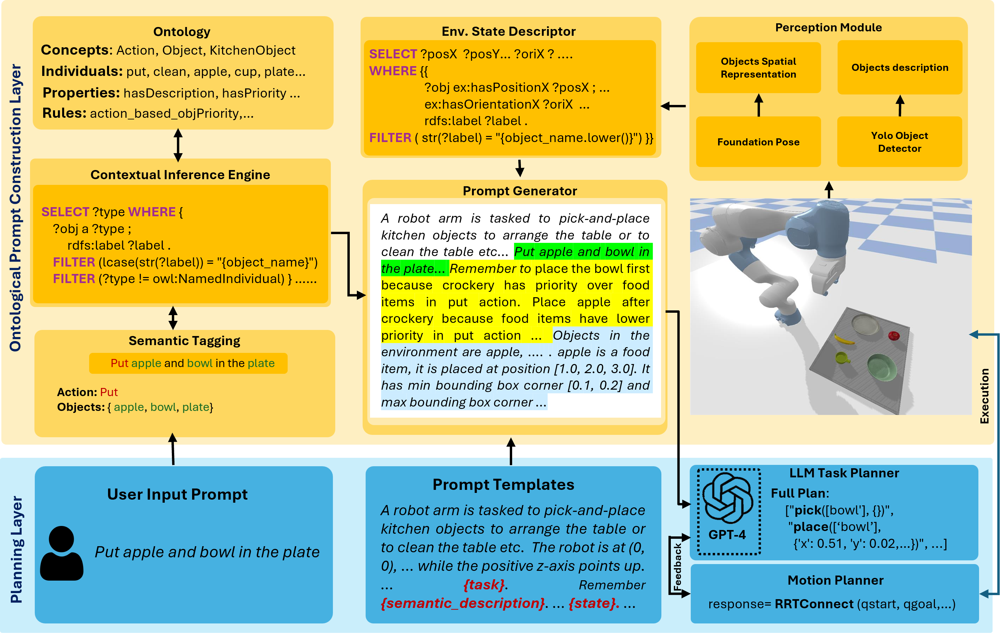
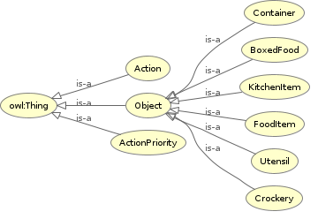
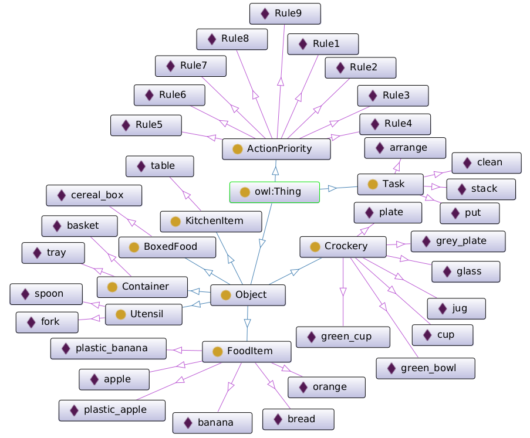

<meta http-equiv="Content-Security-Policy" content="script-src 'self' 'unsafe-eval';">

        Onto-LLM-TAMP: Knowledge-oriented Task and Motion Planning using Large Language Models

    Muhayy Ud Din, Jan Rosell, Waseem Akram, Isiah Zaplana, Maximo A Roa, and Irfan Hussain

  
  
  

  

<h5 style="margin-bottom: 10px;"> Overview </h5>

Performing complex manipulation tasks in dynamic environments requires efficient Task and Motion
Planning (TAMP) approaches that combine high-level symbolic plans with low-level motion control.
Advances in Large Language Models (LLMs), such as GPT-4, are transforming task planning by
offering natural language as an intuitive and flexible way to describe tasks, generate symbolic
plans, and reason. However, the effectiveness of LLM-based TAMP approaches is limited due
to static and template-based prompting, which limits adaptability to dynamic environments and
complex task contexts. To address these limitations, this work proposes a novel Onto-LLM-TAMP
framework that employs knowledge-based reasoning to refine and expand user prompts with task-
contextual reasoning and knowledge-based environment state descriptions. Integrating domain-
specific knowledge into the prompt ensures semantically accurate and context-aware task plans. The
proposed framework demonstrates its effectiveness by resolving semantic errors in the symbolic plan
generation, such as maintaining logical temporal goal ordering in scenarios involving hierarchical
object placement. The proposed framework is validated through both simulation and real-world
scenarios, demonstrating significant improvements over the baseline approach in terms of adaptability
to dynamic environments and the generation of semantically correct task plans.

<h5>Citation</h5>

<pre><code>@article{din2025llmguidedtaskmotionplanning,
      title={Onto-LLM-TAMP: Knowledge-oriented Task and Motion Planning using Large Language Models}, 
      author={Muhayy {Ud Din} and Jan Rosell and Waseem Akram and Isiah Zaplana and Maximo A Roa and Irfan Hussain},
      year={2026},
      journal = {Robotics and Autonomous Systems}
}</code></pre>

<h5 style="margin-bottom: 10px;">Knowledge-oriented LLM-TAMP results</h5> 

    

<h7 style="margin-bottom: 20px;">Results in Real Environment</h7>

<video width="100%" height="auto" controls autoplay muted loop>
  <source src="https://github.com/Muhayyuddin/llm-tamp/raw/refs/heads/llm-site/assets/Onto-LLM-1.mp4" type="video/mp4">
  Your browser does not support the video tag.
</video>

<h7 style="margin-bottom: 20px;">Results in Simulation Environment</h7> 

<video width="100%" height="auto" controls autoplay muted loop>
  <source src="https://github.com/Muhayyuddin/llm-tamp/raw/refs/heads/llm-site/assets/sim1.mp4" type="video/mp4">
  Your browser does not support the video tag.
</video>

<video width="100%" height="auto" controls autoplay muted loop>
  <source src="https://github.com/Muhayyuddin/llm-tamp/raw/refs/heads/llm-site/assets/sim2.mp4" type="video/mp4">
  Your browser does not support the video tag.
</video>

<h6 style="margin-bottom: 5px;"> Prompt Tuning Results on Random Inputs</h6>

We evaluated the proposed prompt-tuning framework using various random inputs within the kitchen domain to thoroughly test the functionality of the prompt-tuning module. The video below showcases sample responses generated by the reasoner, which clearly highlights the actions, the list of objects involved, and the corrected order of object manipulations.

 <video width="100%" height="auto" controls autoplay muted loop>
  <source src="https://github.com/Muhayyuddin/llm-tamp/raw/refs/heads/llm-site/assets/prompt.mp4" type="video/mp4">
  Your browser does not support the video tag.
</video>

 

<!--

    Trackers performance on real data.

  

!-->

<h5 id="framework" style="margin-bottom: 10px;">Onto-LLM-TAMP Framework</h5>

The ontology-driven LM-TAMP framework enhances prompt elaboration for generating semantically accurate symbolic plans. It begins by processing the user input to extract actions and objects through semantic tagging. The Contextual Inference Engine uses SPARQL queries to retrieve object types and priorities from the ontology, ensuring the correct action sequence based on predefined rules. The Perception Module, with YOLO-based object detection and FoundationPose for object pose estimation, provides real-time spatial data. This information is textualized using ontological knowledge by the Env State Descriptor and fed into the Prompt Generator. The final prompt is then fed into the LLM Task Planner, which produces a structured task plan. Finally, the Motion Planner ensures the robot executes the task with feasible, collision-free movements.

  

<h5 id="framework" style="margin-bottom: 10px;">Ontological Knowledge Graph</h5>

Below is the class hierarchy of the ontologies that are used in the paper as example use cases

  

Below is the sample ontological knowledge graph along with some individuals from the ontologies that are used in the paper as example use cases

  

<h5 id="faqs" style="margin-bottom: 10px;">FAQs</h5>
<h8>Q1- Why we need Ontology-driven LLM-TAMP?</h8> 

Ontology-driven LLM-TAMP is crucial because it combines the generative capabilities of language models with the structured reasoning of ontologies to address the limitations of traditional LLM-TAMP approaches. It enhances task planning success rates by providing domain-specific knowledge, logical rules, and explicit object relationships, reducing instruction ambiguity. By incorporating an ontology, the system minimizes reliance on LLM calls, improves efficiency, and ensures robustness in complex and underspecified scenarios. This approach ensures semantically correct task sequencing and more reliable execution, making it ideal for real-world, complex environments.

<h8>Q2- What is the benefit of this research work?</h8>

This research enhances task and motion planning (TAMP) by integrating ontology-driven reasoning with large language models, enabling robots to understand better and execute complex, multi-step tasks. By utilizing structured domain knowledge, the approach ensures higher accuracy, reliability, and efficiency, even in scenarios with ambiguous or incomplete instructions. Practical applications include household automation (e.g., cleaning and organizing), warehouse management, healthcare assistance, and industrial robotics, where precise object categorization and task sequencing are crucial. This work bridges the gap between human-like contextual understanding and robotic precision, advancing the usability of intelligent systems in real-world environments.

<h8>Q3- What are the limitations of the proposed approach?</h8>

The limitations of the ontology-driven LLM-TAMP approach primarily arise from its dependence on pre-defined ontologies and structured knowledge bases. The approach may struggle with tasks involving objects or actions not covered by the ontology, leading to reduced flexibility. Additionally, the dependence on LLMs for natural language understanding can result in errors when faced with highly ambiguous or novel prompts. Real-time performance may also be affected in complex scenarios due to the computational overhead of reasoning and query processing.

